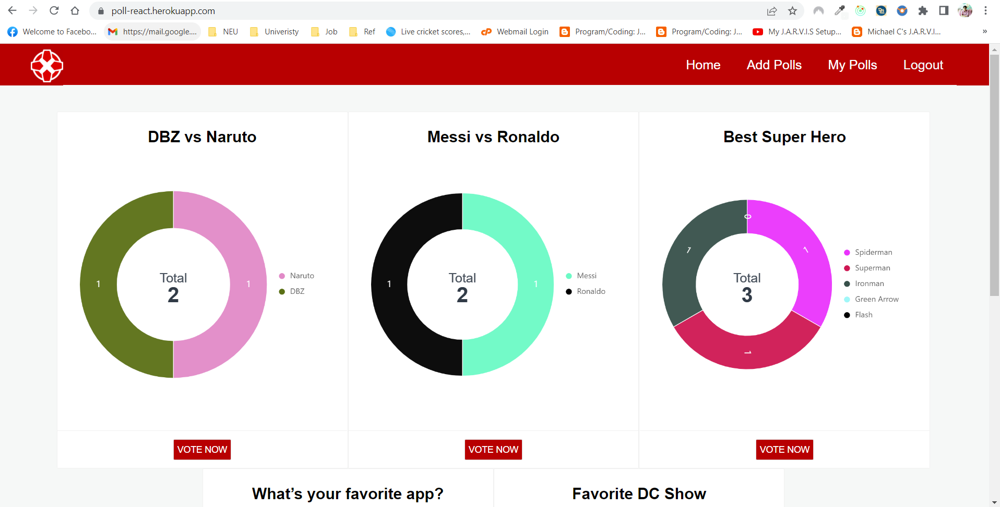
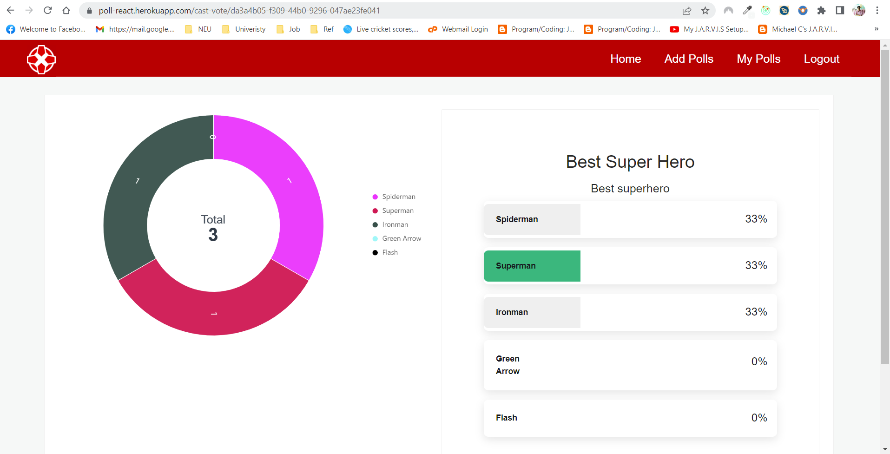
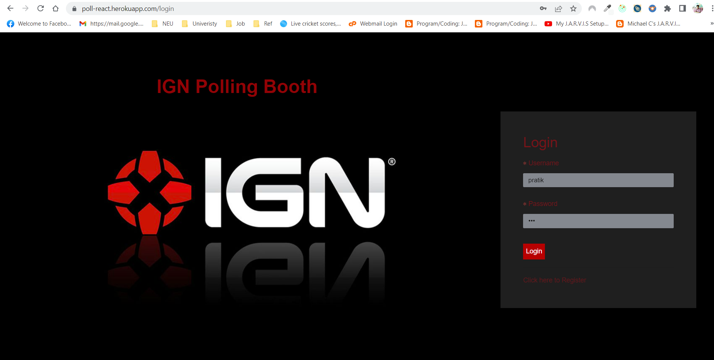
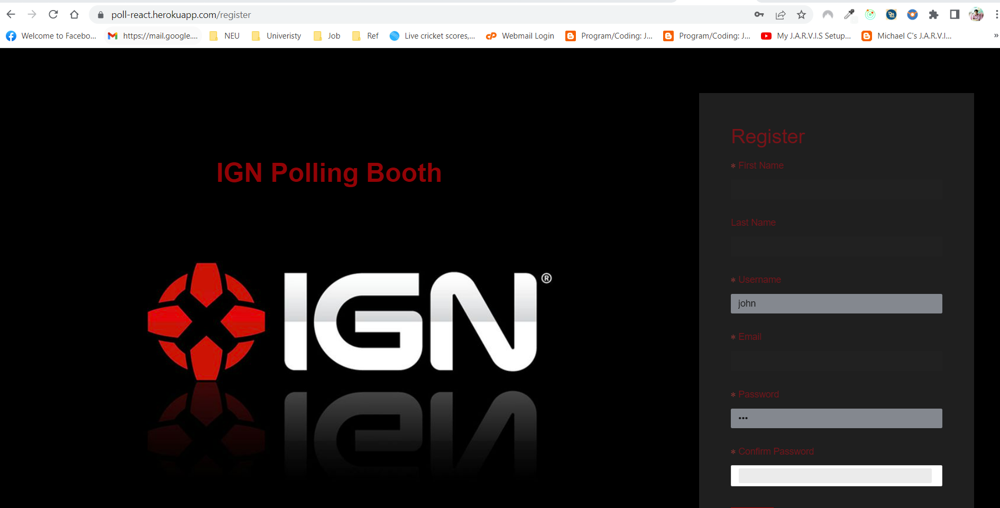

## Polling Client App

Deployed on [https://poll-react.herokuapp.com/](https://poll-react.herokuapp.com/)

Github: [Backend](https://github.com/pratikg17/polling-server)

1. Install Nodejs
2. Run the following command to install dependencies `npm install`
3. `npm start` to start the client app
4. Go to `localhost:3000`

## Screenshots

## Home Page

### Vote Page

### Login Page

### Register Page

## Tech Stack

1. React
2. Redux Thunk
3. AntD Component
4. Bootstrap
5. Axios
6. Github Actions
